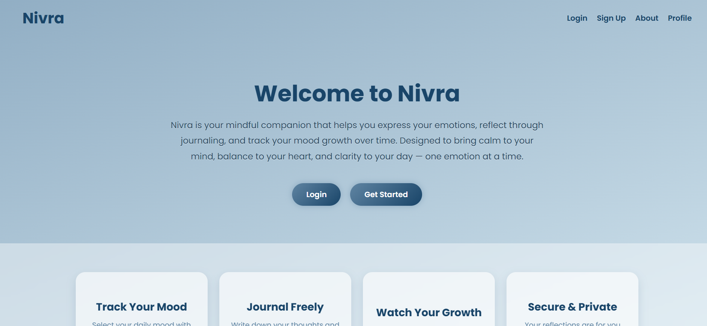
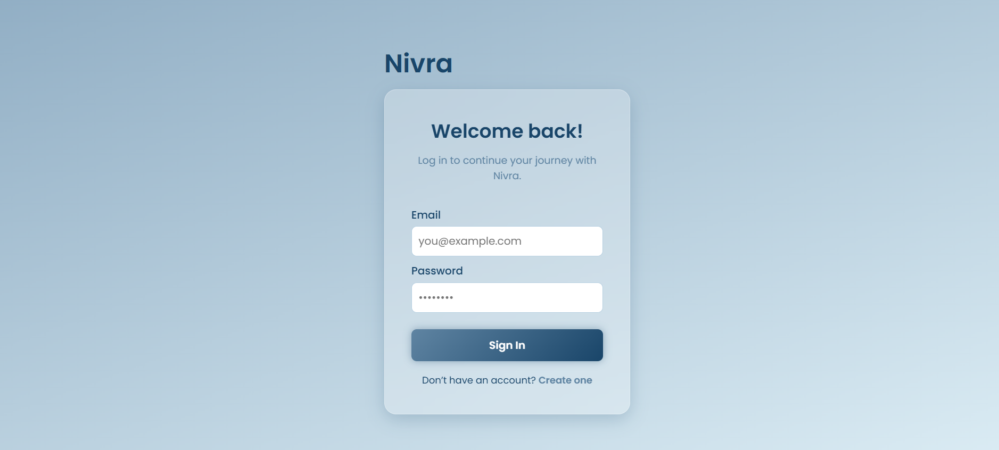
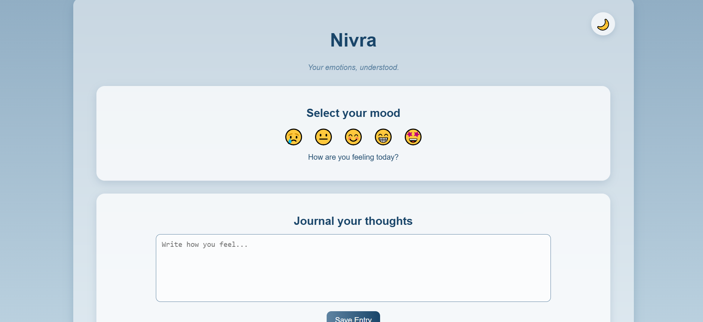
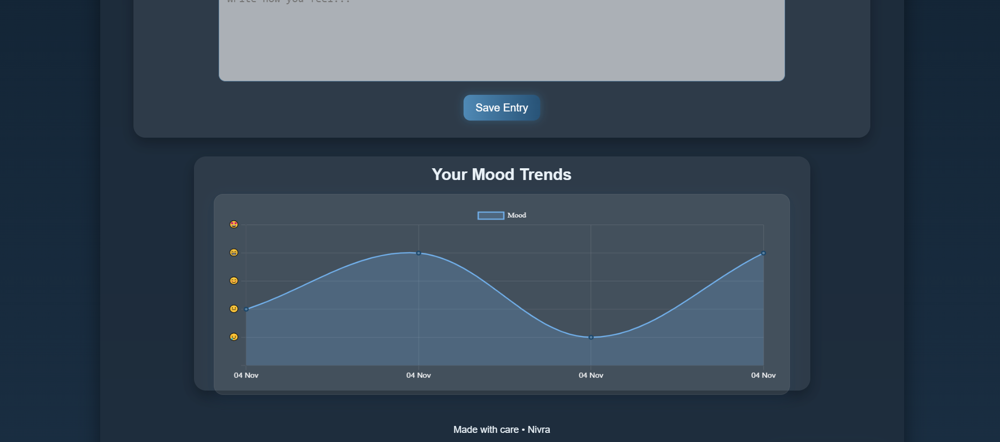

#  Nivra — Your Emotions, Understood  

Nivra is a **mental wellness companion web app** designed to help users understand, reflect on, and track their emotions in a calm, friendly space.  
Built with empathy and simplicity in mind, Nivra lets users record their moods, write their thoughts, and visualize emotional trends over time — all while maintaining a clean and peaceful aesthetic.  

---

## 🧠 Project Overview  

Nivra helps users:  
- 🌤 **Track moods** through an interactive emoji-based selector.  
- ✍️ **Journal** their daily feelings and thoughts in a private space.  
- 📈 **Visualize mood trends** using an interactive chart powered by Chart.js.  
- 🔥 **Maintain streaks** to build emotional consistency and mindfulness habits.  
- 🌙 **Toggle between light & dark themes** for a personalized experience.  

---

## 🛠️ Tech Stack  

| Category | Tools & Frameworks |
|-----------|--------------------|
| **Frontend** | HTML5, CSS3, JavaScript (Vanilla) |
| **Chart Visualization** | Chart.js |
| **Styling & UI** | Tailwind-inspired custom CSS, Glassmorphism cards |
| **Data Storage** | LocalStorage (for mood logs & streaks) |
| **Version Control** | Git & GitHub |
| **Deployment** | GitHub Pages |

---

## 🗂️ Pages Overview  

| Page | Description |
|------|--------------|
| **index.html** | Landing page introducing Nivra’s purpose |
| **login.html / signup.html** | Simple authentication pages for user access |
| **dashboard.html** | The main interactive page — moods, journaling, streaks, and graphs |
| **profile.html** | Personalized user profile with mood insights |
| **about.html** | Information about Nivra’s mission and creators |

---

## 📸 Screenshots

### 🏠 Home Page
The welcoming landing page introducing **Nivra** and its calming design.

### 🔐 Login 
Simple and clean authentication pages with smooth transitions.

### 📊 Dashboard
Tracks moods, shows journal entries, and displays mood trends over time.

### 🖤 Dark Mode
The dark theme gives a calm, nighttime journaling experience.

---

## 🌈 Key Features  

- **Mood Selection:** Choose from five expressive emojis to log your daily emotion.  
- **Smart Prompts:** Dynamic mood-based messages encourage reflection.  
- **Mood Graphs:** Visualize emotional patterns over days or weeks.  
- **Streak Counter:** Stay consistent with a glowing fire streak tracker.  
- **Theme Mode:** Toggle between peaceful light mode and deep-focus dark mode.  
- **Local Storage Persistence:** Your data stays safe on your device — no sign-in needed.  
- **Smooth UI:** Rounded glass cards, subtle animations, and a calming color palette.  

---

## ⚙️ How to Run Locally  

1. Clone the Repository
  git clone https://github.com/Meenakshiovveti/nivra.git
2.Open the Project Folder
  cd nivra
3. Launch the App
  Open the html/index.html file in your browser (no server needed).
4. Explore the web application — your moods and journals are saved automatically in your browser.

---

## 🌙 Themes

1.Light Mode — Soft pastel gradient background with calm blue accents.

2.Dark Mode — Deep navy tones with gentle white highlights for focus and comfort.

The theme automatically adjusts charts and text for perfect visibility in both modes.

---

## 🧠 Purpose

Nivra was created to make mental health journaling simple and beautiful.
It encourages users to check in with their emotions daily, offering clarity, reflection, and a sense of growth.
Every mood you log and journal you write is a step toward emotional balance 🌼

---

## 💖 Logo Meaning
The Nivra logo features a heart with a gentle scanner  — symbolizing emotional awareness and the balance between mind and heart.  
It reflects the core purpose of **Nivra**: to help users tune in to their feelings, track their moods, and take care of their mental wellness with calm and clarity.

---

## 👩‍💻 Author

Meenakshi Ovveti

1st year ECE 

Frontend Developer & Designer of Nivra

Built for novathon 2025 under the theme Mental Wellness through Tech

---

## 📜 License

This project is open-source and available under the MIT License.
